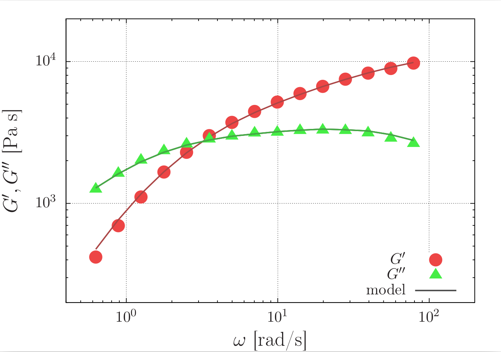
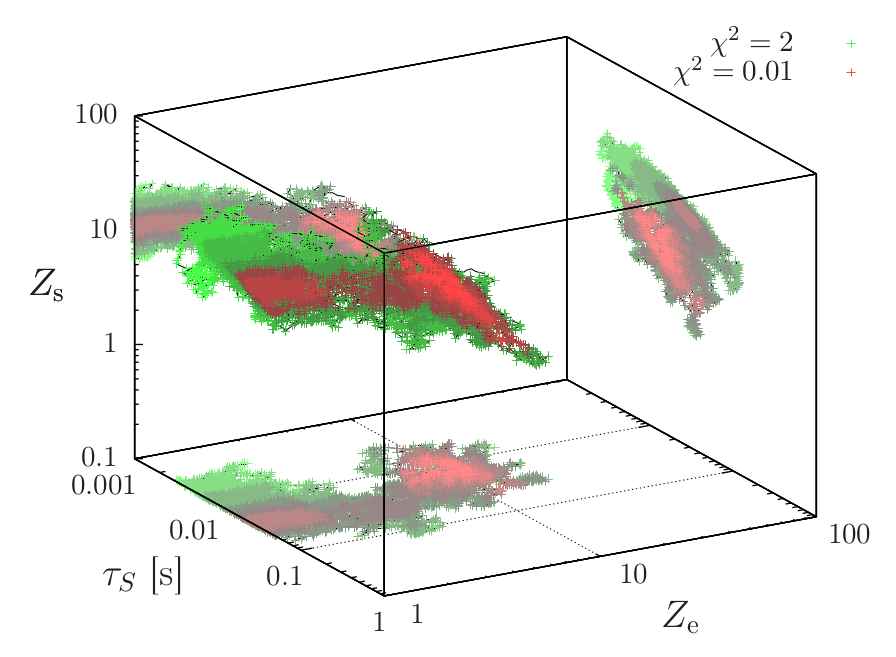

# Bombyx: Modelling of linear viscoelasticity


## About

Bombyx is specifically developed to compare the sticky-reptation model to experimental rheology data using Monte Carlo curve fitting. For rheological software with a broader scope, see .

The development of the software took place at the University of York, UK, and was funded by the EPSRC under grant number EP/N031431/1. The software is freely distributed under the GNU General Public License Version 3 (2007); see LICENSE.txt. 

## Features

### ModuliLIB 


Generated using the demo under this .
The graph shows the relaxation of a linear polymer. The characteristic features are determined by Rouse relaxation at high angular frequencies, dissociation of reversible crosslinks at intermediate frequencies, and polymer reptation at low frequencies.  


### Curve fitting 

 | 

  Markov Chain Monte Carlo algorithm to explore the parameter space, identify local optima and find the global optimum (see right figure).

### Utilities

* FitReport.html file for a visual summary of the results  
* Gnuplot scripts for graphical output.  
* runBombyx.sh to compile and run software, as well as to call postprocessing scripts  
* bash scripts for postprocessing

## System requirements

### Software dependencies:

* gcc compiler: The core program to evaluate the physical model and to fit it to data is written in C. The source code should be portable to most platforms (Linux, Mac OS, Windows). **NOTE** for compilation on Windows the *.o* extensions of executables should be changed to *.exe*.  
* bash: run routines in shell scripts (.sh) to compile the program and to change program input/settings and move/copy/delete program input. These should run on Linux Mac OS, and on Windows using Cygwin, MinGW's MSYS, or bash under Windows 10 using the "Windows Subsystem For Linux".  
* (optional) Postprocessing and other utilities:  
  * gnuplot: plotting of data. (see http://www.gnuplot.info)  
* (optional) debugging: valgrind (see http://valgrind.org)  
* (optional) Browser to open html output

Versions of bash, gcc, gnuplot and valgrind are available for Linux, Mac OS, Windows and many other platforms.

### Versions the software has been tested on

* operating system: Linux clinux 3.16.0-7-amd64 #1 SMP Debian 3.16.59-1 (2018-10-03) x86_64 GNU/Linux  
* compiler: gcc version 4.9.2 (Debian 4.9.2-10+deb8u2)  
* using shell scripts: GNU bash, version 4.3.30(1)-release (x86_64-pc-linux-gnu)  
* plotting: gnuplot 4.6 patchlevel 6   
* debugging: valgrind-3.10.0  
* viewing FitReport.html: Mozilla Firefox 43.0


### Hardware:

* No non-standard hardware is required: all software was tested using a Dell Latitude E6530 laptop with quad-core processor: Intel(R) Core(TM) i7-3520M CPU @ 2.90GHz.

## Installation

Installation only requires a couple of compilations that are completed in a couple of seconds.
These compilations are performed using the shell (bash) script 

```./buildBombyx.sh```

This executes the following actions:  

* Create a *build* directory in which simulations should be run.  
* Copy *runBombyx.sh* from *utils* to *build*.  
* Run ```runBombyx.sh -c``` to compile the libraries *ModuliLib* and *ZiltoidLIB* and the executable *Bombyx.o*

When successfully compiled, the fitting can be done by adapting the ```USER INPUT``` in *runBombyx.sh* to the system of interest and running ```./runBombyx.sh -c -p```.
The typical workflow is detailed in *doc/user_manual.pdf*.


## Documentation

A user manual can be found in the [doc directory](doc).
This demo discusses

* The curve-fit algorithm and the sticky-reptation model.  
* Software installation.  
* Test run (couple of minutes runtime on regular desktop computer).  
* Expected results of the test run.  
* How to apply the software to other data sets.

### Bombyx curve fitting

The comparison of the Sticky Reptation (SR) model to experimental data involves a rough chi-square landscape with many local minima, and correlations between the extracted values of the physical parameters. 
In order to not get trapped in local minima, as gradient methods would, *Bombyx* relies on a Markov Chain Monte Carlo algorithm.
In this algorithm, the probability to escape local minima is controlled by an *acceptance probability*, and *step size* but within certain *lower and upper boundaries* of the values physical parameters.
The efficiency of the algorithm highly depends on these numerical settings, which are defined by the user of the software (see *doc/user_manual.pdf* for an example).

The software input is set by adapting the ```USER INPUT``` section in the plaintext shell script ```runBombyx.sh```, which can then be run as  
``` ./runBombyx.sh [arguments] ```  
Typically, ```./runBombyx.sh -r -p ``` runs the Monte Carlo algorithm (-r) and postproceses the results (-p). Alternative options are described when ``` ./runBombyx.sh --help``` is run.
Following this procedure, the fitting results and the quality and reliability of the fit can be judged from the graphical output in *FitReport.html* (which displays and describes the png images generated in *img*) and from the numerical output in *bbx_errordata.out*.

Usually, running the algorithm takes typically a couple of seconds to minutes, depending on the number of iterations set by the user. 
However, the results may show multiple local minima, and on physical grounds some local minima may be excluded by rerunning the simulation with different parameter boundaries.
Poor choices for the input parameters can therefore result in a time consuming process to obtain a decent fit quality.
How to make good choices that result in an efficient workflow is demonstrated in the user manual (*doc/user_manual.pdf*), where the fitting of an actual experimental dataset (provided in *Demos/demodata*) is discussed step by step.

### Software development


**Importing data:** Experimental data is imported from plaintext files with 4 columns (frequency, G'', frequency, G'), and headers with physical information. See example *Demos/demodata/demodata_15_2.bbx*.
This data is imported using src/Import. Importing of the data is demonstrated in *Demos/demo_ReadInput.c*, which is compiled and run by the script ```./compile_ReadInputDemo.sh```.
This script should take a fraction of a second; the expected shell output is provided as commented text in the compile_ReadInputDemo.sh file.

**Physics-ModuliLIB**: The physical models for linear viscoelasticity are implemented in *lib/ModuliLIB* and include the Maxwell model, Sticky Rouse, Double Reptation, and Sticky Reptation, see J. des Cloizeaux, Macromolecules 23, 4678 (1990), L. Leibler, M. Rubinstein and R. H. Colby, Macromolecules 24, 4701 (1991), and Q. Chen, Z. Zhang and R. H. Colby, J. Rheol., 60, 1031 (2016).
After compiling the library (either by running ```./buildBombyx.sh```, or by running *lib/ZiltoidLIB/makeZiltoidLIB.sh* and *lib/ModuliLIB/makeModuliLIB.sh*), the functionalities of *lib/ModuliLIB* can be tested using the scripts in *lib/ModuliLIB/Demos*.
The run time of the scripts range from a fraction of a second to a couple of seconds. 
The scripts can also be run in debugging mode using *valgrind* (by parsing "--debug" argument to the script).

A demonstration of how to implement the sticky-reptation model in a c program and running it for different physical parameters is provided by the demo  
``` ./compile_StickyReptation.sh ```  
which compiles *demo_StickyReptation.c*, runs the compiled executable for various physical parameters, compares the output with the expected output (demodata/StickyReptation.txt), and plots the results using *gnuplot*.

The sticky-reptation model itself depends on a number of functionalities that can be tested individually:  

*  Finite Element Analysis (Approximate dynamic moduli from relaxation modulus, see Nobile and Coccini, Rheol. Acta 40, 111 (2001)):  
   ```./compile_NobileFEA.sh``` calculates the double-reptation G' and G'' for various numerical settings.  
*  Sticky Rouse  
   ```./compile_StickyRouse.sh``` calculates Sticky Rouse relaxation numerically (using FEA) and compares the results to the analytical result.  
*  Double reptation  
   ```./compile_descloizeaux.sh``` tests the implementation of the numerical calculation of the g(x) and F(x) infinite sums used in the double-reptation model (J. des Cloizeaux, Macromolecules 23, 4678--4687, 1990)


**Future features**:  
* Program version is defined in src/main.h.  
* Display key results of *bbx_errordata.out* in *FitResults.html*.  

 


